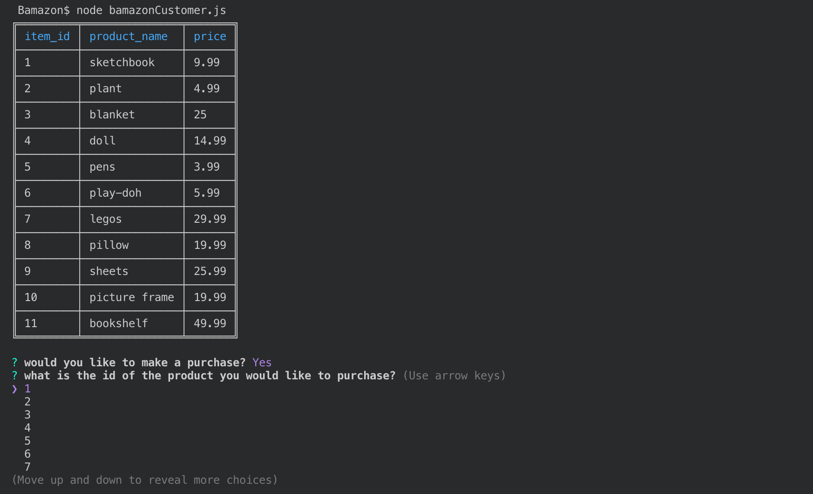
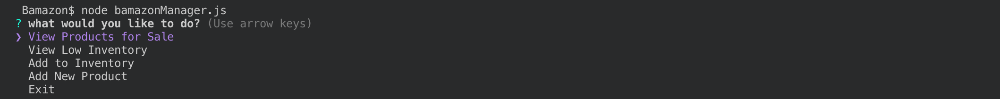
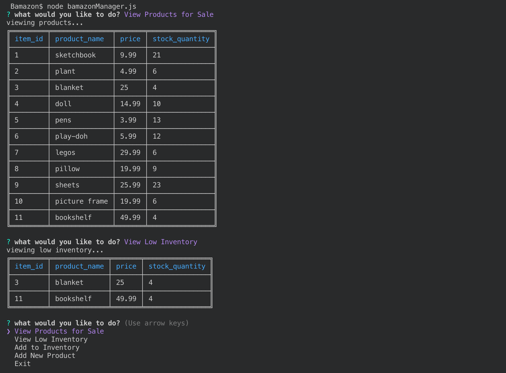
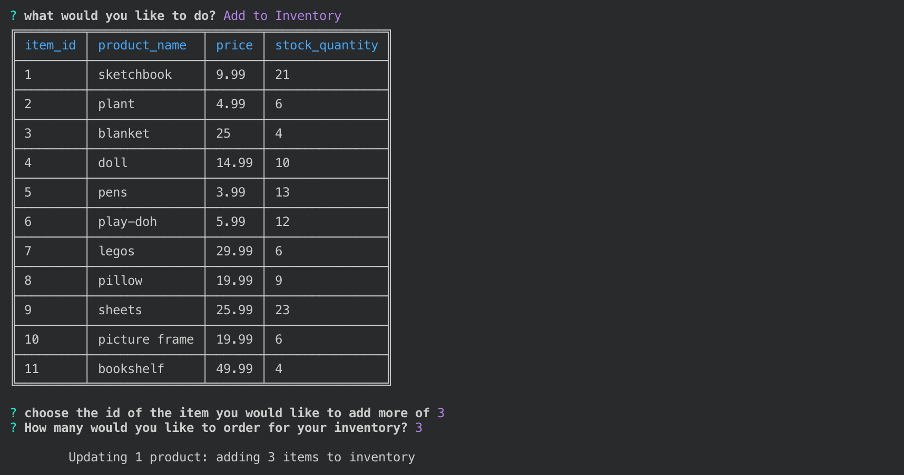
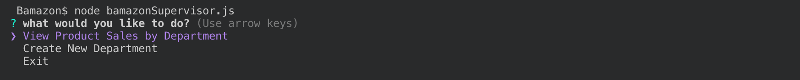
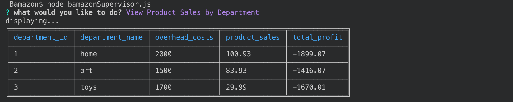

# Bamazon

## Purpose and Overview

This app was created to simulate a virtual store. It connects to a mysql database which contains both products and departments tables. 

These tables contain information on:
 All of the products which are currently offered including - 
  id, name, price, current number in stock, and product sales
 All of the departments in the store including - 
  id, name, overhead costs

Three options are available for viewing and interacting with this data.
You can choose to view as a customer, manager, or a supervisor; each with their own access and options

## Use

There are three different user options for this app: 

  1. **CUSTOMER**

  Customers are able to view the products available and decide if they would like to make a purchase.

  

  They can then decide what they would like to purchase and how much of it, and it will display a total cost

  

  1. **MANAGER**

  Managers are able to: 

  

  View all of the products available or view just the products with low inventory

  

  Add more stock of a particular item

  

  Or add a completely new item to the store

  

  1. **SUPERVISOR**

  Supervisors have the ability to view the departments and all of the information which goes with them, or to add a new department 

  

  

  

## Development

Node was used for the development of this app

The packages used in this development are:
  * inquirer
  * mysql
  * colors
  * table
  * dotenv

The code is organized into three separate js files for each of the three possible roles of people accessing this information: 
  - bamazonCustomer.js
  - bamazonManager.js
  - bamazonSupervisor.js

I completed this project independently as an assignment for my coding bootcamp. 